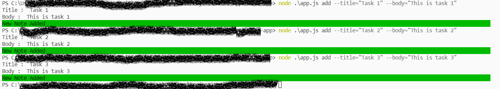
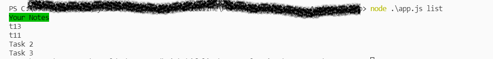

# ToDoApp
This is ToDoApp Application Developed for learning basics of nodejs.  
The Application works on console.  
The Application using File System to store new ToDo to the database.  
Setup:  
npm install  
1)To Add a new ToDo

  
2)To Remove the Note from the App

  
3)To View the list of the note

  
4)To Read the specific note 

